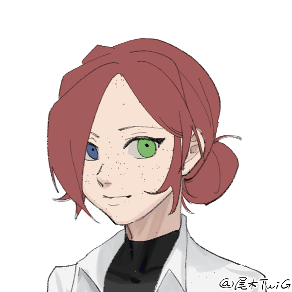

# ─────༺ Présentation ༻─────  
  
**Nom** : Arai  
**Prénoms** : Maeling  
**Métatype** : Humaine — Mage  
**Âge** : 26 ans  
  
**Affiliation** : Police Métropolitaine de Néo-Tokyo  
**Métier** : Détective  
  
# ─────༺ Compétence ༻─────  
**Implants** :   
- Implants Matriciels : Datajack, Comlink  
- Interface de contrôle   
  
!!!ad-tip
**🔥 Nécromancie**{: .title}  
Maeling est capable de communiquer et de contrôler les morts. Elle peut notamment les lier à elle, mais aussi à des objets ou corps.   
    
**Compétences** :  
- *Médium :* Maeling est capable de voir les morts et de communiquer avec eux.   
- *Lazare* : En fusionnant avec les morts, Maeling acquiert leur connaissance et souvenirs sur du court terme. Cette compétence n'a pas de conséquence sur la psychologie de Maeling, qui a une très grande force mentale et arrive à différencier ses propres souvenirs de ceux des morts.  
- *Lien* : Maeling est capable d'emprisonner des âmes dans des objets afin de pouvoir communiquer avec eux sans interruption, mais aussi de les rappeler plus tard afin de fusionner avec eux.  
- *Nécron* : Maeling peut attacher un cadavre à une âme et la contrôler à distance. Cette technique lui demande énormément d'énergie, et l'épuise énormément.  
- *Fonderie* : Elle est capable de "réparer" un cadavre, c'est-à-dire soigner ses blessures, sans pour autant le ranimer ou apaiser sa douleur. En vérité, plus elle utilise cette technique, plus le zombie deviendra fou de douleur.   
  
# ──────༺ Description ༻──────  
**Yeux** : Vairon. Le droit est vert, le gauche est bleu.   
**Cheveux** : Roux; mi-long, attaché en un chignon sévère.  
**Taille** : 1m70   
**Poids** : 60kg  
**Peau** : Blanche  
**Traits notables** : Tâche de rousseurs sur l'ensemble du corps.  
**Cicatrice** : Aucune.  
**Style vestimentaire** : Sévère, chic.  
  
Maeling possède cet air distant et étrange que l'on a tendance à attribuer — à tort ou à raison — aux mages. Toujours semblant regarder ailleurs, la jeune femme est plus à l'aise avec les morts qu'avec les vivants. Taciturne malgré elle, les gens qui ne la connaissent pas ont tendance à l'éviter. Comme on raconte, un Necromancien est un bon Necromancien mort.  
  
Mais malgré ce qu'on raconte sur elle, la jeune femme est étrangement joviale, paraissant aussi parfois rigide. On a du mal à la cerner, surtout à cause de son tempérament solitaire.   
  
$~~~~$ Maeling possède un visage simple, légèrement pointu, avec d'étrange yeux vairons en amande. Non naturel, cette heterochromacie est causé par son pouvoir. "Le bleu, les morts. Les verts, les vivants." Vrai ou non, elle n'était pas là à sa naissance et est apparue lors de l'éveil de ses pouvoirs. De là à voir un lien...  
Son visage possède quant à lui quelque qualité, notamment des lèvres fines et un petit nez retroussé, lui donnant un léger air doux.  
  
Sa stature, et le reste de son corps, n'ont rien à envier à d'autres. Cependant, malgré les séances de sports obligatoires, elle reste une femme plutôt quelconque, musclé mais sans forme que l'on attribuerait à la gente féminine.   
Elle ne s'en offusque pas particulièrement, car — probablement à cause de son lien avec la mort — elle ne se soucie pas des vivants. Célibataire endurci, donc.   
  
On retrouve Maeling généralement vêtue de tailleurs, ou de l'uniforme réglementaire. De son temps libre, elle préfèrera les vêtements souples et amples, mais il est rare de la voir sans un tailleur strict. La seule fantaisie de ses vêtements se trouvent dans ses chaussures, qui sont des bottes épaisses, en cuir, brune, ainsi qu'une casquette.   
  
Elle ne paraît pas timide, ni méchante, juste froide et taciturne. Cela dit, quand on apprend à la connaître, on comprend que Maeling est une femme calme, qui sait écouter et prendre des décisions malgré la pression. En vérité, Maeling est détachée presque entièrement du monde qui l'entoure, et elle a du mal à ressentir des émotions ou des sensations. Elle peut donc se montrer extrêmement brutale si on le lui demande, parce qu'elle est plus ou moins sans aucune empathie. Parfois, elle semble plus proche des morts que des vivants, mais ne les respecte pas pour autant : parfois, la fin justifie les moyens, et la torture de morts n'est pas vraiment régie par la Loi.  
  
Notons que, cependant, elle est tout à fait capable de venir à l'aide d'un mort, ou un vivant, s'il requiert son aide. Elle apprécie apaiser les âmes en peine, à défaut d'en avoir une.  
  
# ─────༺ Histoire ༻──────  
$~~~~$ Je n'ai jamais rien ressenti.   
Lorsque les enfants riaient, jouaient, je restais neutre, silencieuse, seule.  
  
Je n'ai jamais fait attention à mes parent. M'aimait-il ? Je sais qu'ils faisaient de leur mieux pour m'assurer une éducation. Nous vivions bien. Ni trop riche, ni trop pauvre. Jamais s'approcher des corpo, mais ne jamais les ignorer non plus. Un entre deux.  
  
$~~~~$ J'avais 3 ans quand j'ai rencontré mon premier fantôme. Je me souviens avoir baraguinée quelque chose à ma mère, qui m'avait observée en haussant un sourcil, mettant l'évènement sur simplement des bêtises d'un enfant de 3 ans.  
  
Elle fut plus inquiète lorsque que je lui dis, deux ans plus tard, avoir rencontré ma grand-mère, décédée deux jours plus tôt. Cette fois là, ils mirent ça sur la tristesse de perdre quelqu'un. Dans les faits, je n'avais rien ressenti.Lorsque ce fut le tour de mon oncle, à mes 10 ans, ils ne purent trouver d'excuse : j'étais une mage.