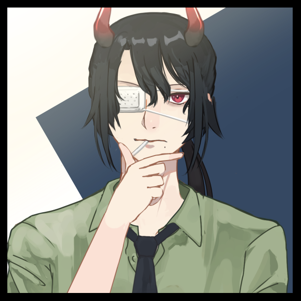

# ─────༺ Présentation ༻─────  
**Nom** : Salem  
**Âge** : ~1500 ans  
**Genre** : M  
**Orientation** : Hétéro (oui)  
**Race** : Démon   
**Pouvoirs** :   
1. **Nécromancie** : Salem est capable de ramener les morts à la vie en enchainant leurs âmes à leur cadavre. Il peut aussi enchainer une âme sans lien avec le cadavre, et donc ramener des personnes dans des corps différents à l'origine. Les zombies ramenés sentent la douleur et la plupart sont à moitié fou.   
2. **Marionnette** : Il est capable de créer des "faux" zombies à l'aide de sa magie. Il utilise cette technique principalement, et dans ce cas, il est obligé de les contrôler à l'aide de "chaines".  
3. **Chaine** : Il est capable de créer des chaines qu'il peut utiliser pour attraper ou blesser.  
4. **Couteau** : À force d'utiliser des couteaux pendant 1500 ans, il est devenu un expert et les utilise principalement pour se battre. Il rate rarement sa cible. De plus, il les attache souvent à ses chaines pour se battre.   
  
# ──────༺ Physique ༻──────  
  
**Yeux** : Rouges  
**Cheveux** : Noirs  
**Taille** : 1m70  
**Poids** : 65kg  
**Peau** : Blanche ; Pâle  
**Traits notables** : Il est borgne de l'œil gauche ; il possède des cornes comme la majorité des démons.  
**Cicatrice** : Sur l'œil gauche sans son masque.  
**Style vestimentaire** : Simple, plutôt rock des années 80.  
  
# ──────༺ Descriptions ༻──────  
Salem n'est pas quelqu'un de gentil, contrairement à ce qu'il veut faire croire à Hayleen. Affublé d'une malédiction liée à ses souvenirs, il se souvient entièrement de ses 1500 ans, de toutes ses guerres et amis perdus. Cela la rendu froid, et quelque peu fou, mais il n'en montre absolument rien à Hayleen, ou Zéphyr. Seule Némo est au courant de la véritable nature du directeur de la cellule Italienne de l'Écho.   
  
Alcoolique, il n'hésite pas à faire passer la manière forte pour obtenir ce dont il a besoin. Sa méthode de torture préférée étant de tuer ses ennemis, les ramener dans leur corps, puis de les torturer jusqu'à obtenir ce qu'il veut. Plutôt facile, lorsque l'on ne peut pas dormir, et que l'on ressent autant d'empathie qu'une petite cuillère.  
Bref, pas quelqu'un de conventionnellement stable.   
Évidemment, en face d'Hayleen, il paraît juste alcoolique, et un peu froid, mais il est **adorable** avec elle, et n'ose pas dire qu'il la considère comme réellement sa fille. De fait, il paraît légèrement étrange, et ne lui a jamais montré ses véritables pouvoirs.  
  
Membre de l'Écho depuis sa fondation, il a décidé de maintenir le statu quo avec le monde des humains, car il a **trop** perdu. Ses amis, ses amantes, sa famille. Il refuse de participer à de nouvelles guerres et de perdre, surtout Hayleen. Cela dit, **putain**, ce qu'il s'en veut de la guerre qui s'est déroulé à Azelyss. Il se dit souvent "si j'avais été là… "  
  
À l'origine il est rentré dans l'Écho pour donner un sens à sa vie, et n'a jamais voulu monter en grade, car garder secret ses méthodes deviendraient compliqué. Contrairement à la majorité des membres, il n'a pas vraiment de grand rêve de Protection, mais préfère faire *le bien* plutôt que le *mal*.   
  
---  
# ──────༺ Relations ༻──────  
- Père adoptif de [[Hayleen May]]  
  - Ancien allié de [[Iblis]]  
  - Ex-Ami-Mec de [[Zéphyr]]  
  - Chef [[Echo]] : Chevalier  
  - Connaît [[Capricorne]]