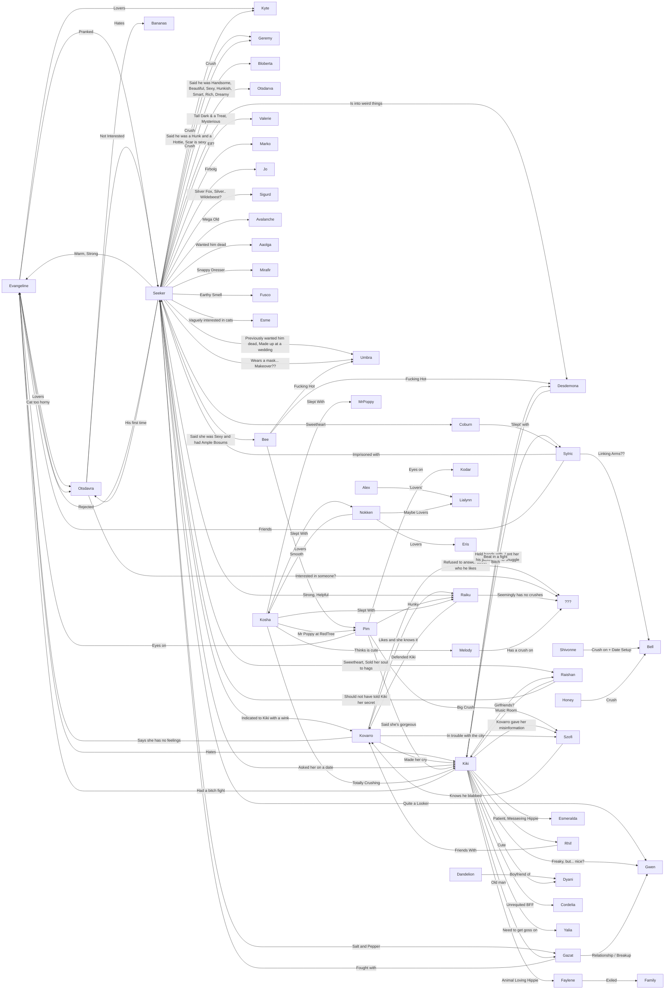

# Char Images & Inspo

# Backstory 
Being raised by a medusa is tough. Especially when she's not your real mom!

Kiki (so named by her adoptive mother) is a sassy dhampir with parent issues. She knows little about her blood lineage, despite her father's petrified corpse decorating her childhood living quarters. 

Momo, her snake-haired guardian, did not like to talk about it, which meant of course, that it was incredibly important for Kiki to find out all she could. After eroding Momo with questions over many years, she learned a few things, but nothing that would help trace her family back to its roots.

- She was born to a different mother, of whom she knows nothing about. She was seemingly alive at the time Momo took her under her wing.
- Momo was attempting to woo her father when a bad fight broke out, leaving him petrified. Kiki was slung across his back for travelling when he was turned to stone, but unaffected by the gaze. A twinge of guilt led Momo to feel a sense of obligation over the baby boy. 

Asking more was always threading a fine line, for of course there was always a risk her mother would glare at her to cease her pestering once and for all.

An impressionable child, Kiki took on many facets of Momo including a insatiable thirst for gossip, but her fascination with space technology and dhampir romance novels never appealed to her. In fact, she hated those books and blamed them, without evidence, of her mother's petrification of her real father. She did enjoy a good gossip mag though.

Kiki left Momo's care as she grew into an adult, exploring the world on the cushion of her adoptee mother's horde. She spent a good portion of the money on some magic teaching, another portion on transitioning, and all the rest on partying and carousing. 

When the money ran out, Kiki didn't feel like returning home to the dark dank cave filled with stone memories and shunned her mother to continue out on her own, earning some cash on the road. Momo continues to send her messages, but Kiki refused to return. Slowly, the fracture between the two is mending.

Tales of the Mark reached her from both her travels and her mother. It seemed too good to be true - easy cash, free food, hot coworkers and opportunities to kick people's asses for profit. What wasn't to like? Plus, it seemed like these folk had plenty of skeletons in their closets for airing out.

Despite her prickly exterior, Coco longs for a place she can call home in the outside world. Somewhere that feels like a real whole family, and who knows, maybe a hot spouse and a few children (but they are SO hiring a nanny. She's not dealing with that)

# Description
Kiki has light brown skin and almost-white blonde hair. One or two tiny snakes live in there.

She is tall at 5'10" and slender, like many dhampir. She's often got a viol in hand, or strapped to her back. Her true height is a bit smaller, for she is never seen without her high stiletto heels which double as a weapon in case of emergency. Of course, she has a pair of rolled up flats stashed away just in case the terrain calls for it.

Kiki likes to wear colours that accent her skin tone or hair, and when dressing up, her makeup is always flawless. She prefers form fitting clothes to loose ones.

For an adventurer, she has relatively few visible wounds. She has issues looking people directly in the eye, preferring to play to a faceless crowd, or talk past people.

# Town Entrance
A vicious brawl crashes out of one of the tavern doors into the streets, bringing with it a cacophony of yelling and angry roars. Two men are mercilessly punching the life out of each other whilst others cheer them on. 

A slender figure emerges behind them with a smirk she can barely contain, so she hides it badly behind her painted fingertips. After watching the entertainment for a short while, she leaves them to pick up the pieces and continues walking down the road.

The stranger's name is Kiki and she's been in Corvus a week, getting a feel for the place before signing up to join the guild. This morning, she arrives at the bakery - something she's done each morning since arriving in, and waves over the owner.

"So, like, I'm going to the Mark today" *Kiki announces, grabbing a cinnamon bun from the display.* "Your buns are like, hella tasty, but you have to like, pay for them, or whatever! I totally don't know how you're still in business" *Before the shop keeper can retort, she continues.* "Anyways, I didn't come to tell you about that, I wanted to tell you that Sandra, the butcher next door, is like, totally dissing your pastries. I was there yesterday and she told me that you cut your flour with sawdust. That's like, so not cool, Sandra. I can't believe she'd do that. Especially since I hear she gets her meat on the black market" *Seeds of discord planted, Kiki places down a few silver for the freshly cooked bun and takes a big fanged bite of the cinnamon bun, before turning on her tall stillettoed boots and leaving.* "Laters!" 

*Eventually, the stranger arrives at the Mark's gates and scoffs* . "Oh my god, it actually exists! The senile old man's sugardaddy mansion" *She readjusts her viol and few small bags on her back, reminding her that she can't stand outside gloating at it forever.* "Let's see if this place is as good a goldmine for money and fame as they say!"

"Hey you!" *She calls to a passerby carrying some turnips on their way to the market street.* "Open that door for me". They stop pushing their wheelbarrow and help open the doors. Kiki doesn't say thank you, just strides in and tosses her junk on the nearest chair, before looking around for whoever runs this sham of a place.

At last! Kiki has entered the Mark!

# Inspiration Board

Kiki is a dhampir who drinks blood
But she also drains their emotions. (Physically by drinking, and also just from being a pest.)

# Emoji

# Phrases For getting into character
Gag me with a spoon
Barf!
Take a chill pill!
What's your damage?
What's up with your face?
Oh my gawd, so gross
Mega burn!
Sure, Totally!
Like, Whatever!

# Mischief Graph

**Melody has a crush on:**
A female Hatchling
- Kosha - Maybe, Knows Melody?
- Mara?
- Ginko?
- Nhyla?
- ~~Winifred~~
- Carthas?

## Backstory Info

A painting with Kiki's parents(?) on it. A tall elegant, white haired woman ssits on a throne
Her mother is the ruler of Castle Rock + her father was her consort.

"I don't think they're around anymore. Been a while and no one goes that far North anymore"

> > _Between the two, they find some information. The Twin Rocks, Castle Rock and Fort Rock were two fortifications, one in Current Vershnila and one in The Lost Kingdoms. They were part of a small governance that settled in the land of the North before the unification of Vershnila as a whole. Both towns made up Moorloom and they were governed by one **Beatrix Nightcrest** . They were absorbed into Vershnila as the country came as one and the Aundale rule rose to power._ _During some unknown time Fort Rock at Vershnila was destroyed in a revolt from nearby settlements, the land overran and taken by neighboring cities. With the nation of Vershnila growing with time, the Vershnila path and crossing to Lost Kingdoms was lost during the "Years of Sorrow". A time where those who crossed into the lost lands would often become ill or become victim to the rise of undead threats._ _Most information has faded into obscurity with time, there seems to be centuries since any information about it exists. They simply find a couple of things in very old texts. The location of what was Moorloom's land, and both Rocks, are sketched on an old, antique Vershnilian geographical map from a cartographer's journal._