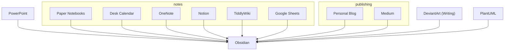

```ad-note
This article is a first draft and needs review + editing. This is not its final incarnation
```


# Obsidian

[Obsidian](https://www.obsidian.md) is a self-described knowledge-base of local knowledge - but it's essentially an IDE for Markdown files with a few extra bells and whistles.

In [my previous article](../the-value-of-unstructured-thought), I wrote about how I find a bullet journal really useful for allowing unstructured thoughts to be stored in a single place, without the implicit pressure of compliance to the form of regularly structured notepad pages. 

Obsidian scratches the same itch. I can develop my notes and knowledgebase as much (or as little) as I want. And it's freeing.

## Daily Notes
One of the core features they provide is recurring Daily Notes. This has been invaluable for keeping track of my active tasks for work. 

In the past, I had a desk calendar, with a small space for each day during the week - which would inevitably overflow into other pages. It was a great quick reference to get started in the morning - and possibly more importantly - to allow my brain to shut off once work was done.

There are also Weekly and Monthly variants, but I find these work better offline for getting my mind straight about particularly hectic weeks.

## Other Built-In Features
Other really useful features I've found have been:
- The ability to Present your notes - I don't have to power up the beefy PowerPoint to illustrate a simple idea.
- Mermaid support, for quick reference diagrams.

## Premium Features

Obisidan offers a few premium features - Sync and Publish being the main two.

However, with Obsidian's community plugins, it's reasonably straightforward to connect your files with git and have a backup system across multiple devices.

[YAFPA](https://github.com/ianfhunter/yet-another-free-publish-alternative/) ("Yet Another Free Publish Alternative") has also allowed me to publish select notes to the web. You're probably reading this on this solution right now! This wasn't quite as straightforward, but with a combination of GitHub Actions and Github pages, I have it working autonomously. When I write something publishable in my notes, it'll be online within the next few minutes.

The main thing I'm missing is the Mobile app. And I may be able to solve this at some point (for having it on the go would be very handy), but for now, it's not super vital to me.

(TODO: sequence diagram of auto-publishing)

# Replacement
So let's have a look at what I've replaced by using obsidian:



Of course, not everything is a perfect replacement, but certainly my knowledge is a lot more centralized and cohesive now.

It has somewhat superceded my Bullet Journal, but I still find value there - but the focus is now on freeform drawing, than knowledge collation or task tracking.